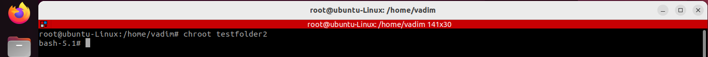
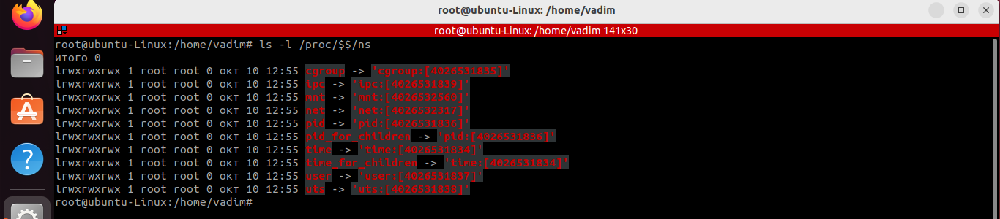
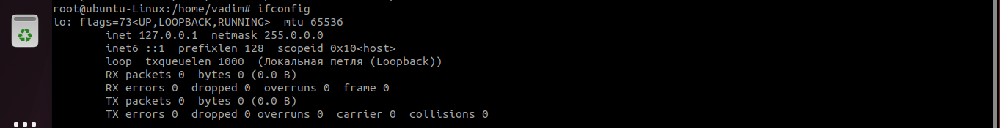
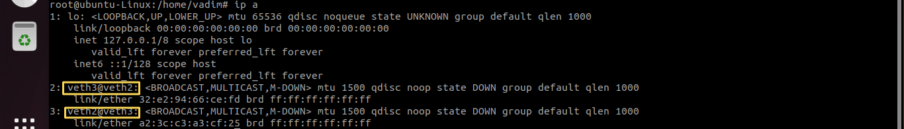
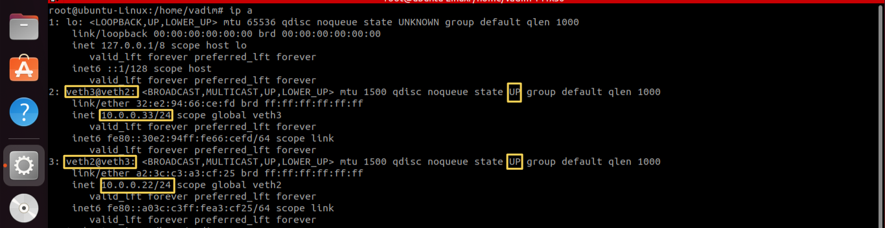
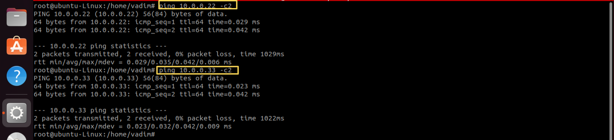
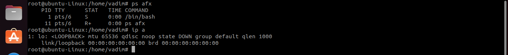

## Тимофеев Вадим, группа № 4334/4336/4338
Семинар № 1 по Контейнеризации

`1. Практика по изоляции оболочки`

> 1.1 Подготавливаю директории для оболочки bash и библиотек в lib и lib64: 

mkdir –p testfolder2/bin  
mkdir testfolder2/lib  
mkdir testfolder2/lib64  
cp /bin/bash testfolder2/bin  

> 1.2 смотрю зависимости оболочки по библиотекам и копирую их в соответствующие дирректории  

ldd /bin/bash  
cp /lib/x86_64-linux-gnu/libtinfo.so.6 testfolder2/lib  
cp /lib/x86_64-linux-gnu/libc.so.6 testfolder2/lib  
cp /lib64/ld-linux-x86-64.so.2 testfolder2/lib64  

> 1.3 изолирую оболочку  

chroot testfolder2

 

> 1.4 хочу добавить в изолированную среду утилиту "ls":  

ldd /bin/ls  
cp /lib/x86_64-linux-gnu/libselinux.so.1 testfolder2/lib  
cp /lib/x86_64-linux-gnu/libpcre2-8.so.0 testfolder2/lib  
chroot testfolder2  
ls 

 

`2. Работа с пространствами имён`

> 2.1 Смотрим текущие пространства имен

ls -l /proc/$$/ns

 

> 2.2 Список сетевых пространств имен:  

ip netns list  //выведет только именованные сетевые пространства имен  

> 2.3 Создаем новый сетевой экзепляр

ip netns add test2ns

> 2.4 Запуск командной оболочки с изоляцией сетевых процессов  

sudo ip netns exec test2ns bas

> 2.5 Поднимаю localhost

ip link set dev lo up

 

> 2.6 Добавляю сетевое устройство virtual ethernet veth 

как пара устройств: veth2 and veth3

ip link add veth2 type veth peer name veth3

> 2.7 Связываю правое устройство veth3 с сетевым экземпляром test2ns

ip link set veth3 netns test2ns

> 2.7 Проверили что пара устройств создана:  

ip a

 

> 2.8 Задаю сетевой адресс устройству veth2

sudo ip addr add 10.0.0.22/24 dev veth2

> 2.9 Поднимаю устройство veth2  

sudo ip lin set dev veth2 up

> 2.10 Задаю сетевой адресс устройству veth3

sudo ip addr add 10.0.0.33/24 dev veth3

> 2.11 Поднимаю устройство veth3

sudo ip lin set dev veth3 up

**Результат:**   

*По идее - сетевой мост теперь должен работать*

> Проверяю соединение

ping 10.0.0.22 -c2
ping 10.0.0.33 -c2

 

> 3. Создать новое пространство имен с помощью unshare

sudo unshare --net /bin/bash

> 3.1 Проверяем создание сетевого пространства имен

ip a

> 3.2 Создать изолированное пространство имен

sudo unshare --net --pid --fork --mount-proc /bin/bash  
1. --pid //изоляция системных процессов, а именно их идентификаторов  
2. --net //сетевая изоляция
3. --fork //для запуска команды в новом пространстве имен. Таким образом, у /bin/bash будет PID = 1
4. --mount-proc //mount - создает новое пространство имен, proc - создает виртуальную файловую систему procfs, благодаря чему мы не видим информацию о текущих процессах в хостовой системе
ps afx  

Результат:
